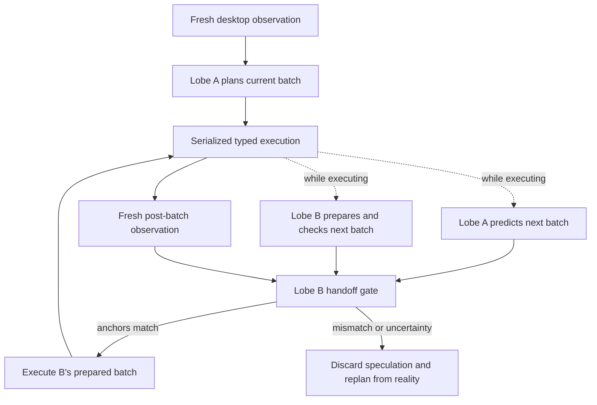

# NeuralAgent-style dual-lobe runtime

Compuse now has a model-facing runtime designed around the behavior users
expect from a desktop computer-use agent: observe the visible desktop, plan a
short sequence, execute real mouse/keyboard actions, observe again, and keep a
durable journal of what happened.

The runtime is provider-neutral. Any OpenAI-compatible vision endpoint can be
used, including a compatible gateway, by setting:

```powershell
$env:COMPUSE_LLM_BASE_URL = "https://api.example.com/v1"
$env:COMPUSE_LLM_API_KEY = "your-key"
$env:COMPUSE_LLM_MODEL = "your-vision-model"
python -m pip install -e ".[desktop]"
compuse-agent "Open Chrome and navigate to example.com" --live
```

`--live` is an explicit capability switch. Without it, the adapter can observe
but refuses physical input, so a model call cannot accidentally move the user's
mouse or type into an application.

## The pipeline



The important property is bounded speculation. A and B may use model time
while the current batch is physically executing, but physical mutations remain
serialized through the Coordinator. B's next batch is eligible only when:

1. it names the current `batch_id` as its source;
2. it preserves the current batch's predicted end-state anchors;
3. the real post-batch observation matches the predicted coordinate space,
   foreground window, URL, or visible markers; and
4. the current batch returned no failure or unknown result.

If any check fails, the predicted batch is thrown away. This is the mechanism
that provides fast continuous movement without turning a wrong prediction into
blind clicking or typing.

## Batch contract

Every batch contains:

- up to eight discriminated, typed actions;
- a bounded set of executable preconditions;
- a `predicted_end` state with checkable anchors;
- confidence and risk labels;
- a source lobe and optional barrier/terminal marker.

The current adapter uses headed desktop screenshots and active-window identity.
UI Automation/OCR markers can be added to `RuntimeObservation` later without
changing the scheduler contract. Until an anchor is available, strict
speculative handoff is rejected and the runtime replans from a fresh view.

## Relationship to NeuralAgent

This implements the same useful product shape—visible desktop control,
cross-application actions, fast action generation, stronger planning/recovery,
and execution visibility—but it does not claim to reproduce NeuralAgent's
private model or internal implementation. Compuse's distinguishing layer is
the explicit predicted-state handoff and fail-closed invalidation.

## Current boundary

This is the first Windows vertical slice, not a finished unattended product.
The live adapter uses PyAutoGUI for physical input and a small Win32 identity
reader. Before production use, add UI Automation grounding, OCR/marker
extraction, cancellation, durable permit state, independent postcondition
verification, crash recovery, and an interactive Windows acceptance suite.
